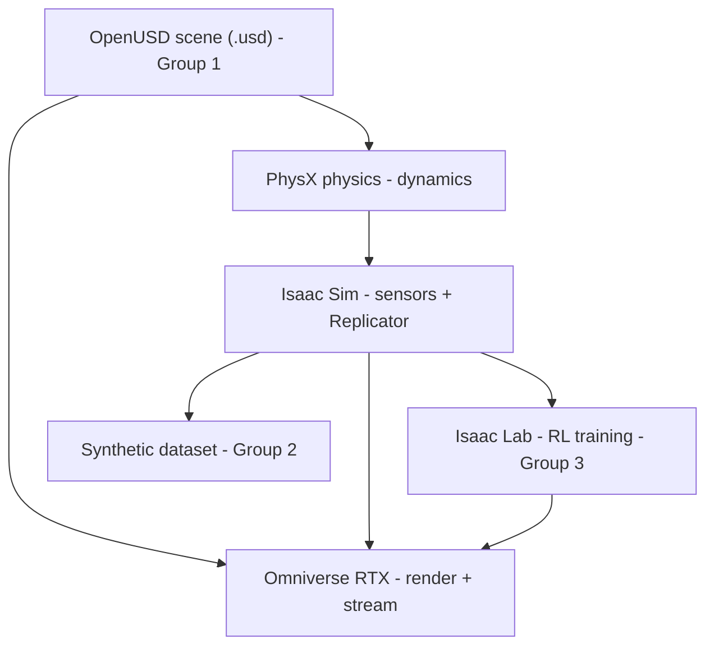

# JWST-Inspect

A reproducible, research-grade benchmark for autonomous spacecraft inspection,
built in NVIDIA Omniverse with the James Webb Space Telescope as the target.
NVIDIA-sponsored Harvard Extension School graduate capstone; three independent
teams; one shared AI workstation with two RTX PRO 6000 Blackwell GPUs.


*Above: the detailed NASA JWST model and the inspector microsat over a real
16k all-sky star map, rendered with RTX path tracing on this workstation
(3840x2160, Omniverse RTX renderer). Everything in this README was run on the
box and is reproducible by you.*

This README is the whole practical guide: where everything is, which tool to
use when, and how to run and see it - on the command line and in the GUI.

---

## 1. What you are building

The research question: can inspection policies trained in fast rasterized
simulation stay reliable when evaluated under RTX path-traced rendering,
specular spacecraft materials, sensor noise, latency, and standoff safety
constraints? Three standalone deliverables, one per team, integrated only
through published interfaces so no team waits on another:

- Group 1 - Digital Twin and Asset Benchmark: the reusable JWST OpenUSD scene,
  inspector microsat, materials, semantic labels, safety zones, validation
  renders.
- Group 2 - Synthetic Data and Perception Benchmark: the Replicator data
  pipeline, labeled dataset, data card, perception baselines.
- Group 3 - Autonomous Inspection and R2P Evaluation: the Isaac Sim/Lab
  environment, scripted + learned policies, and the rasterized-to-path-traced
  evaluation.

---

## 2. Connect to the workstation

You reach exactly one machine, `jwst-ws`, over Tailscale. You get SSH,
JupyterHub, Omniverse streaming, and the MLflow dashboard - nothing else.

One time: install Tailscale and sign in with the account the admin invited to
the tailnet; put the SSH private key the admin gave you in `~/.ssh/`. Then:

```bash
# macOS / Linux
ssh -i ~/.ssh/<your-key> <username>@jwst-ws
# Windows (PowerShell)
ssh -i $env:USERPROFILE\.ssh\<your-key> <username>@jwst-ws
passwd            # on first login, set your JupyterHub password
```

- JupyterHub (browser): http://jwst-ws:8000
- MLflow experiment tracking (browser): http://jwst-ws:5000
- Omniverse GUI: streamed over WebRTC (section 9)

If `jwst-ws` does not resolve, Tailscale is off or your login is not in the ACL
yet - ask the admin. No SSH client at all? You can do almost everything from a
browser: open JupyterHub (http://jwst-ws:8000), then New > Terminal for a full
shell on the box. Section 9 shows how to launch the GUI that way too.

---

## 3. Project structure: where everything lives and what goes where

Everything you use is under `/data`. Your home has shortcuts to it, so `ls ~`
already shows the shared areas. The tree below also says what each folder is for
and what you should put there as you start building.

```
/data/
  shared/                     read-only to you except where noted
    project/                  this README, helper scripts, the streaming client
      README.md               <- you are here
      bin/                    student helper commands (jwst-gui, jwst-gpucheck)
      assets/screenshots/     the images in this README
      assets/tools/           Isaac Sim WebRTC Streaming Client (download to your laptop)
    raw/                      public NASA/STScI data (read-only) - see section 5
    assets/                   Group 1 PUBLISHES here: jwst_inspect_scene_v1.usd,
                              materials (MDL), semantic_labels.json, validation_renders/
    datasets/                 Group 2 PUBLISHES here: synthetic dataset, data_card.md, schema
    checkpoints/              Group 3 PUBLISHES here: policy checkpoints (.pt), R2P eval CSVs
    containers/               the 3 GPU container images (Isaac Sim, Isaac Lab, Composer)
    env/                      shared conda envs + the Isaac Lab source tree
  groups/
    digital_twin/  benchmark/  autonomous/     one per team; YOUR team is writable
      jwst_inspect/           your team's shared clone of its GitLab fork (section 16):
        README.md  data/  docs/  assets/       the shared root everyone sees
        digital_twin/  benchmark/  autonomous/  all three team trees; yours is where you ship
          src/  sbatch/  interface/            code, job scripts, stable contracts
      runs/ + caches          runtime output next to the clone, never in git
  scratch/                    fast, ephemeral, auto-cleaned after 14 days - big temp outputs
/home/<you>/                  your private home (0700) - notebooks, keys, your dev clone
```

What goes where when you build:

- Your day-to-day code and notebooks: your personal clone `~/jwst_inspect`
  under `<your team>/src/`, pushed as topic branches and merged by your
  representative into `~/team/jwst_inspect` (section 16). Private scratch work
  can live anywhere in `~`.
- Anything another team needs from you: publish a stable copy into your
  `<team>/interface/` in git and, for the big artifacts, into the matching
  `/data/shared/` area (`assets/`, `datasets/`, `checkpoints/`). Others read
  those, never your working `src/`.
- Large intermediate files (renders in progress, raw rollouts, dataset shards
  mid-generation): `/data/scratch/<you>/` - it is fast and auto-cleaned.
- Run outputs (training state, TensorBoard, rollouts): `~/team/runs/` - next
  to the clone, never inside it.
- Never put big outputs in your home or in git; respect the quotas.

Home shortcuts (created for you):

| Shortcut | Points to | Use for |
|---|---|---|
| `~/project` | `/data/shared/project` | this README + helper scripts |
| `~/team` | `/data/groups/<your team>` | your writable workspace |
| `~/teams` | `/data/groups` | read other teams' work |
| `~/data` | `/data/shared/raw` | the public datasets |
| `~/shared` | `/data/shared` | assets, datasets, checkpoints, envs |
| `~/scratch` | `/data/scratch` | large scratch output |

Write only in `~/team`, your `~`, and `/data/scratch`. You can read and run
every other team's work but not overwrite it. Raw data is read-only for everyone.

---

## 4. The NVIDIA stack: which tool when

Four NVIDIA technologies sit in one stack. You rarely pick just one - they
compose - but each has a job, and knowing which one you are in keeps you from
fighting the wrong tool.


| Tool | What it is | Reach for it when | Team | CLI or UI |
|---|---|---|---|---|
| OpenUSD | The scene file format (`.usd/.usdc/.usdz`) that describes geometry, materials, cameras, lights | You are defining or inspecting the scene, labels, coordinate frames | G1 (all read) | both (`jwst-usd` env; Composer UI) |
| Omniverse RTX | The renderer (rasterized + path-traced) and the streaming layer that shows any of the below | You need pixels: validation renders, hero images, the live viewport | all | UI (streamed) + headless renders |
| PhysX | The physics engine inside Isaac Sim (rigid bodies, forces, collisions, zero-g) | You need real dynamics: 6-DoF motion, thrusters, keep-out collisions, orbital relative motion | G3 (G1 for mass props) | both |
| Isaac Sim | The robotics simulator: loads USD, runs PhysX, simulates sensors (RGB/depth/LiDAR/IMU), hosts Replicator | You are building the environment, sensors, or generating data | G2, G3 | both |
| Isaac Lab | The reinforcement-learning framework built on Isaac Sim (task configs, vectorized envs, RL algorithms) | You are training or evaluating a learned policy | G3 | CLI (view live in UI) |

How they stack, and how work flows through them:



Rule of thumb: author and inspect scenes in Omniverse USD Composer; build
environments, sensors, and synthetic data in Isaac Sim; train policies with
Isaac Lab; let PhysX handle the physics inside Isaac Sim; and use the Omniverse
RTX renderer (real-time to author, path-traced for final images) whenever you
need to see or export pixels.

---

## 5. The data (all in `/data/shared/raw`, every file in `manifest.csv`)

`manifest.csv` records bytes, sha256, source URL, and retrieved-at for every
file. Sizes below are what is on the box now.

| Folder | What it is | Size | How to use it |
|---|---|---|---|
| `jwst_geometry/` | NASA JWST CAD: detailed model A (`model_a/`, Maya source + real gold/sunshield textures, plus a ready `nasa-jwst-model-a.usdc`), light model B GLB seed, 3D-print STL/USDZ kit | 108 MB | Group 1 target geometry; open the `.usdc` directly in Isaac Sim / Composer |
| `jwst_ephemeris/` | Real JPL Horizons JWST state vectors (sun- and earth-centered, 2022-2026, 6 h steps) | 4 MB | Orbital mechanics: L2 halo, sun vector per epoch, comms distance. Load with pandas |
| `env_lighting/` | Deep Star Maps 2020 (8k/16k EXR), TSIS-1 solar spectrum, measured Au/Al/Si optical constants | 820 MB | Dome/star backgrounds, physical sun, MDL material grounding |
| `jwst_imagery_fits/` | 137 JWST MIRI + NIRCam calibrated images (NGC 3132, WR 140, SMACS, Stephan's Quintet) | 6.0 GB | Background layers, filter-to-color, perception context. Load with astropy |
| `ifu_cubes/` | 23 MIRI MRS IFU spectral cubes | 3.0 GB | Volumetric backgrounds (FITS to VDB to USD) |
| `speed_plus/` | Stanford SPEED+ spacecraft pose benchmark (synthetic + hardware-in-the-loop), CC BY 4.0 | 16 GB (33 GB extracted) | Group 2 synthetic-to-real domain-gap transfer track |
| `inspector_refs/` | JWST commissioning report (incl. the real C3 micrometeoroid strike) + inspector heritage refs | 13 MB | Anomaly classes, inspector design |

Loading examples:

```python
# FITS image (env: jwst-astro)
from astropy.io import fits
hdul = fits.open("/data/shared/raw/jwst_imagery_fits/ngc3132/"
                 "hlsp_jwst-ero_jwst_miri_ngc3132_f770w_v1_i2d.fits")
sci = hdul["SCI"].data                      # 2D calibrated image, MJy/sr

# Ephemeris (env: jwst-base or jwst-astro)
import pandas as pd
eph = pd.read_csv("/data/shared/raw/jwst_ephemeris/"
                  "jwst_horizons_vectors_sun_2022-01-01_2026-12-31_6h.csv")
# columns: datetime_jd, datetime_str, x,y,z (au), vx,vy,vz, range, ...

# USD stage (env: jwst-usd, or inside the Isaac Sim container)
from pxr import Usd
stage = Usd.Stage.Open("/data/shared/raw/jwst_geometry/model_a/nasa-jwst-model-a.usdc")
```

The synthetic benchmark dataset is generated by Group 2 with Replicator (not
downloaded); it lands in `/data/shared/datasets/`.

The same raw data (except the two largest sets, SPEED+ and the IFU cubes,
which exceed the git budget) is mirrored in `data/` of the main GitLab project
together with `manifest.csv` and a fetch script for the excluded sets, so the
full data picture travels with the repo. On the box, always read from
`/data/shared/raw`. Details: [data/README.md](data/README.md).

---

## 6. Slurm: how to run GPU work, and which partition when

All GPU work goes through Slurm - never run a bare `python train.py` that grabs
a GPU. There are two GPUs, so jobs queue under load; that is fair-share working,
not a failure. `srun` runs now and attaches to your terminal; `sbatch` submits a
script that keeps running after you disconnect.

| Partition | Limit | Use it for |
|---|---|---|
| `interactive` | <= 8 h, 1 GPU | debugging, a quick render, a GPU shell, JupyterHub GPU notebooks |
| `batch` (default) | <= 3 days | a full dataset shard, a medium training run, validation renders |
| `long` | <= 28 days | multi-week training, the full synthetic dataset, big sweeps |

```bash
sinfo                                            # partitions + node state
squeue                                           # the whole queue
squeue -u $USER                                  # just your jobs
srun -p interactive --gres=gpu:1 nvidia-smi -L   # grab 1 GPU, list it, exit
srun -p interactive --gres=gpu:1 --pty bash      # interactive GPU shell (exit releases it)
sbatch ~/team/jwst_inspect/<team>/sbatch/<job>.sbatch   # submit a long job (survives disconnect)
scancel <jobid>                                  # cancel your job
sacct -j <jobid> --format=JobID,Elapsed,MaxRSS,State,AllocTRES   # what a finished job used
```

When to use which: debugging or a one-off < a few hours -> `interactive`; a run
you will wait on but that fits in a few days -> `batch`; anything multi-day or
that must survive a disconnect -> `sbatch` on `long`. Do not hold an
`interactive` GPU shell open for days; submit it instead.

Shared conda envs (already built; also appear as JupyterHub kernels):

| Env | For |
|---|---|
| `jwst-base` | general Python + PyTorch (CUDA 13 / Blackwell sm_120) |
| `jwst-astro` | FITS / astropy / astroquery |
| `jwst-usd` | OpenUSD (usd-core) authoring and inspection |
| `jwst-rl` | reinforcement learning (PyTorch + RL libs) |

```bash
source /data/shared/env/miniforge3/etc/profile.d/conda.sh
conda activate jwst-rl
```

GPU container images in `/data/shared/containers/` (run via Slurm + Enroot/pyxis;
no Docker for students):

| Image | Has | Use for |
|---|---|---|
| `isaac-sim.sqsh` | Isaac Sim 5.1 + Kit + RTX + Replicator | scene work, SDG, rendering |
| `isaac-lab.sqsh` | the above + Isaac Lab 2.3.2 + RL frameworks | policy training |
| `usd-composer.sqsh` | Omniverse USD Composer | scene authoring GUI |

Run a headless script in the Isaac Sim container under Slurm:

```bash
srun -p batch --gres=gpu:1 \
  --container-image=/data/shared/containers/isaac-sim.sqsh \
  --container-writable \
  --container-mounts=/data:/data,/data/shared/ov-cache/kit:/isaac-sim/kit/cache \
  bash -c '/isaac-sim/python.sh ~/jwst_inspect/<team>/src/my_script.py'
```

Isaac Lab training under Slurm (use `isaac-lab.sqsh`):

```bash
srun -p batch --gres=gpu:1 \
  --container-image=/data/shared/containers/isaac-lab.sqsh --container-writable \
  --container-mounts=/data:/data,/data/shared/ov-cache/kit:/isaac-sim/kit/cache \
  bash -c 'unset VIRTUAL_ENV; cd /data/shared/env/IsaacLab && \
    ./isaaclab.sh -p scripts/reinforcement_learning/rl_games/train.py \
    --task Isaac-Cartpole-v0 --headless'
```

Below: dozens of Isaac Lab environments training in parallel under RTX with the
live rl_games PPO throughput log. Same command, without `--headless`, streamed
to the viewport.


---

## 7. JupyterHub: notebooks in your browser

JupyterHub is the easiest way in - just a browser and Tailscale, no SSH, no
local install. Open http://jwst-ws:8000 and log in with your workstation
account.

- Pick a profile when your server starts: CPU-only, 1 GPU, or 2 GPU. Each
  profile launches your notebook as a Slurm job, so a GPU profile may queue
  behind others (that is normal - check `squeue -u $USER`).
- Pick a kernel per notebook: `jwst-base`, `jwst-astro`, `jwst-usd`, or
  `jwst-rl` (the same envs as the CLI).
- Use it for: exploring the data (FITS, ephemeris), analysis and plots,
  perception model training, reading results, and viewing rendered images
  inline. New > Terminal also gives you a full shell on the box (see section 9).
- Idle servers are culled after 1 hour to free the GPU. Save your work; your
  files persist in `~` and `~/team`.

When to use JupyterHub vs a plain SSH + `srun`: use JupyterHub for interactive,
exploratory, visual work (notebooks, plots, inline images) and to get on the box
without SSH; use SSH + `srun`/`sbatch` for launching long jobs, the streamed
GUI apps, and anything you script.

---

## 8. Tie work to the GPU and monitor it

How a job gets a GPU: Slurm's `--gres=gpu:N` allocates the GPU(s) and sets
`CUDA_VISIBLE_DEVICES` for your job, so your container and app see only what you
were granted. Inside a job you can confirm it:

```bash
srun -p interactive --gres=gpu:1 bash -c 'echo $CUDA_VISIBLE_DEVICES; nvidia-smi -L'
# CUDA_VISIBLE_DEVICES shows your allocated index; nvidia-smi -L lists that GPU
```

The NVIDIA apps pick up that GPU automatically: PyTorch uses `cuda:0` (the first
visible device), and Isaac Sim/Lab render and simulate on it (Isaac uses
`--/physics/cudaDevice=0` for PhysX, which maps to your allocated GPU). You do
not set device IDs by hand inside a single-GPU allocation.

Monitor it. A helper is provided that snapshots the GPUs and interprets the
numbers for you:

```bash
jwst-gpucheck            # one snapshot + plain-language interpretation and flags
jwst-gpucheck watch      # live view (Ctrl-C to stop)
```

Under the hood it uses the standard tools, which you can also run directly:

```bash
nvidia-smi                      # instant status: util, memory, temp, power, processes
nvidia-smi dmon -s pucm         # live per-second: power, util, clocks, memory
nvtop                           # interactive live view (like htop for GPUs)
```

Baseline metrics - what a healthy, performant run looks like on this hardware
(two RTX PRO 6000 Blackwell, 96 GB each; GPU0 capped 525 W, GPU1 300 W; measured
on this box):

| Workload | GPU util | Power | Memory | Throughput seen here |
|---|---|---|---|---|
| Isaac Lab RL training | 80-100% | near the cap | steady, a few GB+ | cartpole ~155k, Ant ~120k env-steps/s (1 GPU) |
| RTX Real-Time viewport | bursty, high | high in bursts | scene-dependent | ~60 fps on the hero JWST scene |
| RTX Path Tracing | ~100% until converged | near the cap | scene-dependent | seconds per final frame; HUD shows spp climbing |
| Replicator SDG | high in bursts | high | a few GB | ~1 frame/s at 1080p with full annotators |
| Idle / queued | 0% | ~15-40 W | near 0 | nothing running (or your job is waiting) |

Raise a flag when:

- Temperature reaches ~84 C (the alert threshold): thermal pressure. Tell the
  admin. Do not change power caps (you cannot, by design).
- Memory is held (hundreds of MB or more) at ~0% util and it is not your job,
  with nothing in `squeue`: likely a stale process. Ask the admin to clear it.
- Your training shows high util but low power, or throughput far below the
  baselines above: you are probably input/data-loading bound, not compute bound
  - check your data pipeline, batch size, and number of workers before blaming
  the GPU.
- `nvidia-smi` reports "out of memory" but nobody is training: same stale-process
  situation - ask the admin.

Track experiments across the team on the shared MLflow server so multi-week runs
are visible to everyone without holding a terminal open:

```python
import mlflow
mlflow.set_tracking_uri("http://jwst-ws:5000")
mlflow.set_experiment("<your team>/<experiment>")
with mlflow.start_run():
    mlflow.log_metric("reward", r)
# browse from your laptop at http://jwst-ws:5000
```

---

## 9. See the UI and run experiments visually

You never install Omniverse locally; the RTX viewport streams to your laptop.
There are three ways to see things, in order of preference.

### 9.1 Live GUI over WebRTC (best for authoring and interaction)

1. One time, install the Isaac Sim WebRTC Streaming Client 1.1.5 (Windows/macOS/
   Linux) from
   https://docs.isaacsim.omniverse.nvidia.com/5.1.0/installation/download.html
   (a Linux copy is on the box at `/data/shared/project/assets/tools/`; Linux
   needs `libfuse2`).
2. On the workstation, start a GPU-scheduled session. The helper prints the
   exact connect steps and schedules it on a GPU for you:
   ```bash
   jwst-gui isaac        # full Isaac Sim app
   jwst-gui composer     # USD Composer (scene authoring)
   jwst-gui pilot        # fly the inspector microsat (section 12)
   jwst-gui physx        # hands-off PhysX orbital-mechanics demo (section 11)
   jwst-gui lab          # Isaac Lab RL training demo, live fps in the terminal
   ```
   (The first two wrap `jwst-stream isaac|composer`, which you can also call
   directly.) Wait for the loaded line (`Isaac Sim Full Streaming App is
   loaded.` for Isaac and the pilot; the RTX-ready lines for Composer).
3. In the client: Server = `jwst-ws`, Connect (signaling TCP `49100`, media UDP
   `47998`, both open on the tailnet). Open a stage with File > Open from
   `/data/shared/assets/` or `/data/shared/raw/jwst_geometry/`. Drive the
   viewport, move the camera, run the simulation, switch RTX Real-Time vs Path
   Tracing. One client per session; File > Exit ends it and frees the GPU.

Isaac Sim, RTX Real-Time viewport, the JWST scene with the inspector and star
field (live FPS/frame-time HUD, top-right):


The same scene switched to RTX Path Tracing (physically accurate glare and soft
shadows; the HUD shows accumulated samples-per-pixel):


USD Composer authoring the same stage, streamed to the WebRTC client:


### 9.2 Launch the GUI without an SSH client

You still need Tailscale and the WebRTC viewer, but not an SSH client: open
JupyterHub (http://jwst-ws:8000) in your browser, choose New > Terminal, and run
`jwst-gui isaac` there. Then connect the WebRTC client to `jwst-ws` as above.

### 9.3 No viewer at all: render to an image (browser only)

If you cannot install the streaming client, render a stage to a PNG on a GPU and
open it in a JupyterHub notebook - only a browser required:

```bash
jwst-gui render /data/shared/raw/jwst_geometry/model_a/nasa-jwst-model-a.usdc \
                ~/scratch/preview.png
```

Then in a notebook:

```python
from IPython.display import Image
Image("/data/scratch/<you>/preview.png")
```

This is a quick preview/visual-check path; for interactive work use 9.1. To
generate labeled data at scale, use Replicator (section 13), not this.

### 9.4 One-click desktop launchers

Every account has app launchers with icons in `~/Desktop` and in the
application menu (they also live in `/data/shared/project/assets/desktop/`).


In any graphical session on the workstation, double-click them; over SSH they
map to the commands you already know:

| Icon | What it does | Same as |
| --- | --- | --- |
| Omniverse Composer | USD scene authoring, streamed | `jwst-gui composer` |
| Isaac Sim | full simulator, streamed | `jwst-gui isaac` |
| Isaac Lab Training | RL training demo, live throughput | `jwst-gui lab` |
| PhysX Orbital Demo | zero-g orbital mechanics, streamed | `jwst-gui physx` |
| Pilot the Microsat | fly the inspector yourself | `jwst-gui pilot` |
| Isaac Sim Stream Viewer | the WebRTC client on the box | `jwst-gui viewer` |
| Ask Jensen | the conversational avatar (section 14) | `ask-jensen` |
| GPU Monitor | live utilization/memory/temps | `nvtop` |
| GPU Health Check | one-shot snapshot + interpretation | `jwst-gpucheck` |
| JupyterHub | notebooks in the browser | http://jwst-ws:8000 |
| MLflow Experiments | experiment tracking dashboard | http://jwst-ws:5000 |

GNOME asks "Allow Launching" the first time you double-click one; accept once.
The streamed apps (Composer, Isaac Sim, PhysX, Pilot) open a terminal that
requests a GPU through Slurm and prints when to hit Connect in the viewer.

---

## 10. Hands-on basics: drive each tool once

Ten minutes per tool. Each walkthrough ends with something you can see. Do
these once and the rest of the stack stops being abstract.

### 10.1 Omniverse USD Composer: navigate, move things, edit a light

Composer is the scene-authoring app - use it to inspect and edit USD stages.

1. `jwst-gui composer`, wait for the RTX-ready lines, connect the WebRTC
   client (section 9.1).
2. File > Open > `/data/shared/raw/jwst_geometry/model_a/nasa-jwst-model-a.usdc`.
3. Navigate: hold right-mouse and use WASD to fly; Alt + left-mouse orbits;
   middle-mouse pans; scroll zooms; select a prim and press F to frame it.
4. Move something: click a mirror segment in the viewport (or pick any prim in
   the Stage panel on the right), press W for the move gizmo, drag an axis.
   E rotates, R scales, Q goes back to select.
5. Edit a light: in the Stage panel find a light prim (or create one:
   Create > Light > Distant Light), select it, and in the Property panel drag
   Intensity - the viewport relights live.
6. Save your edited copy with File > Save As to `~/scratch/` (never overwrite
   the shared source). Close with File > Exit so the GPU frees.

### 10.2 Isaac Sim: open a stage and run physics

Isaac Sim is Composer plus robotics: PhysX physics, sensors, Replicator.

1. `jwst-gui isaac`, wait for `Isaac Sim Full Streaming App is loaded.`,
   connect the client.
2. File > Open the same model A stage. Navigation is identical to Composer.
3. Press the Play button (left toolbar) - the timeline runs and PhysX steps.
   This stage has no physics authored, so nothing moves yet: physics comes
   from applying `RigidBodyAPI`/`CollisionAPI` to prims (section 11 shows a
   full working example you can fly).
4. Select any prim: the Property panel shows its transform and, on physics
   prims, mass and collider settings.
5. Switch the renderer (viewport top-left dropdown): RTX Real-Time for speed,
   RTX Path Tracing to watch samples accumulate into a physically accurate
   frame.
6. File > Exit to free the GPU.

### 10.3 Isaac Lab: train a policy and watch the throughput

Isaac Lab is the RL layer on top of Isaac Sim. Run the validated cartpole
smoke (same command as section 6, `isaac-lab.sqsh` image):

```bash
srun -p interactive --gres=gpu:1 \
  --container-image=/data/shared/containers/isaac-lab.sqsh --container-writable \
  --container-mounts=/data:/data,/data/shared/ov-cache/kit:/isaac-sim/kit/cache \
  bash -c 'unset VIRTUAL_ENV; cd /data/shared/env/IsaacLab && \
    ./isaaclab.sh -p scripts/reinforcement_learning/rl_games/train.py \
    --task Isaac-Cartpole-v0 --headless'
```

Watch the rl_games log: `fps step:` around 155k env-steps/s on one GPU is the
healthy baseline (section 8). Ctrl-C when you have seen it learn (reward
climbs within a minute); checkpoints land under `IsaacLab/logs/`. To see the
parallel envs visually, run the same command without `--headless` from a
`jwst-gui isaac`-style streamed session as in section 6.

---

## 11. Space physics and orbital mechanics (PhysX)

Isaac Sim's physics engine is NVIDIA PhysX. The reference demonstration below
shows it doing real work, not a canned animation:

- Zero-gravity PhysX scene; the inspector is a PhysX rigid body with real mass
  and inertia; JWST carries a keep-out sphere collider.
- The inspector flies a Clohessy-Wiltshire relative-orbit trajectory around the
  telescope, applied as per-step PhysX forces plus discrete thruster burns.
- The sun direction and JWST position come from the real JPL Horizons ephemeris
  for a chosen date, so the lighting matches a real mission epoch.
- A debris field of extra rigid bodies orbits on crossing relative loops.

The demo logs the PhysX-integrated trajectory and compares it against an
independent RK4 integration of the same equations. Measured on the box: over a
55.5 m inspection path with two thruster burns, the PhysX trajectory tracked the
analytic solution to a final drift of 0.29 m (RMS 0.15 m) - the physics engine
and the closed-form orbital mechanics agree.


An animated version (`assets/screenshots/physx_orbital_demo.gif` / `.mp4`) shows
the full fly-around. To watch this physics run live, `jwst-gui physx` (or the
PhysX Orbital Demo desktop icon) streams the same scenario to the WebRTC viewer
with a chase camera and prints the PhysX-vs-analytic drift as it flies; knobs:
`DEMO_SIM_S`, `DEMO_TIME_WARP`, `DEMO_BURNS`, `DEMO_DEBRIS_N` (see
`/data/shared/project/bin/_physx_demo.py`).


The building blocks are all on the box for Group 3 to build
this in the Isaac Sim container: a zero-gravity `UsdPhysics.Scene`, the inspector
as a `RigidBodyAPI` with `MassAPI`, per-step forces via `PhysxForceAPI` for the
Clohessy-Wiltshire terms and thruster burns, a keep-out `CollisionAPI` sphere,
and the ephemeris CSVs for the epoch sun vector. Validate it the same way this
demo did: integrate the same equations with RK4 and compare the drift.

Section 12 puts you inside this exact physics: the pilot tool applies the same
CW terms as per-step PhysX forces and logs the same PhysX-vs-RK4 drift column,
except you command the thrusters.

---

## 12. Fly the inspector microsat (pilot mode)

`jwst-gui pilot` puts you in manual command of the inspector in zero-g around
the full NASA JWST model: real PhysX rigid-body dynamics, Clohessy-Wiltshire
orbital mechanics, a first-person navigation camera, a working sensor suite,
photo documentation, and an optional micrometeoroid-shower damage event you
inspect and report on. Everything you do is logged as analyzable CSV/JSON.


Launch it like any streamed session (section 9.1):

```bash
jwst-gui pilot            # free flight
jwst-gui pilot shower     # same, with the meteor shower armed from the start
```

Wait for `Isaac Sim Full Streaming App is loaded.`, connect the WebRTC client,
then click once inside the viewport so it receives your keyboard.

### 12.1 Controls and HUD

RCS thrusters in the body frame; the FPV camera looks along the boresight.

| Key | Action |
|---|---|
| W / S | thrust forward / back (boresight axis) |
| A / D | thrust left / right |
| R / F | thrust up / down |
| UP / DOWN | pitch; LEFT / RIGHT yaw; Q / E roll |
| SPACE (hold) | brake: damp velocity and rotation with the same thrusters |
| T | auto rate-damp on/off (kills residual spin when you release the keys) |
| [ / ] | halve / double thrust authority |
| V | toggle FPV / chase camera |
| P | photo + JSON state sidecar |
| G | sensor sweep (Replicator rgb + depth + semantic segmentation) |
| M | arm the meteor shower |
| ENTER | write the inspection report |
| ESC | quit (frees the GPU) |

The "Pilot HUD" panel shows range to the telescope, closing rate, speed, body
rates, thrust scale, the delta-v budget, keep-out margin, the live sensor
readouts, and the shower/impact status. The same numbers stream to the logs.

The physics is the section 11 demo with you in the loop: zero-g PhysX, CW
terms applied as per-step forces at a time-warped mean motion (the warp prints
at start; default `PILOT_TIME_WARP=1e5` makes L2-scale orbital curvature
visible in minutes). Let go of the keys and you drift on the relative orbit -
station-keeping costs delta-v, exactly like the real proximity-ops problem.
The delta-v budget (`PILOT_DV_BUDGET_MPS`, default 20 m/s) depletes as you
thrust; at zero the RCS cuts out and you coast. The telescope meshes and an
invisible keep-out shell are solid colliders - you bounce, the mission does not
end. `flight_log.csv` carries an RK4 reference of the same dynamics next to
the PhysX trajectory (`drift_m`), the same validation as section 11.

### 12.2 The sensor suite and its data

Every channel is measured from the live scene (never canned), sampled at
`PILOT_SENSOR_HZ` (default 10) into `sensor_log.csv`:

| Channel | What it measures | How it is grounded |
|---|---|---|
| rangefinder | distance along the boresight + which telescope part it hits | PhysX scene-query ray against the real mesh colliders |
| clearance | distance to the structure toward the telescope center | second PhysX ray |
| photometer | mean/max luminance the FPV camera actually sees (8-bit) | Replicator rgb annotator on the FPV render product |
| solar exposure | W/m2 of sunlight on the craft, 0 when eclipsed | TSIS-1 measured solar spectrum integrated to TSI, scaled by the epoch sun range from the JPL Horizons ephemeris, gated by a sun-occlusion ray |
| radiation proxy | counts/s, background + solar term, spikes in the shower | seeded Poisson model (a documented proxy, not a physics claim; its formula prints at start) |
| IMU | body rates and accumulated delta-v | the same rigid-body state the physics integrates |

Outputs land in `$PILOT_OUT` (default `/data/scratch/<you>/pilot_<utc>/`):
`flight_log.csv` (60 Hz trajectory, commands, drift), `sensor_log.csv`,
`photos/NNN.png` + `NNN.png.json` (full state + sensor snapshot per photo),
`sweeps/NNN/` (rgb + depth + semantic segmentation + sidecar - the same
annotator family as section 13). Analyze them in JupyterHub:

```python
import pandas as pd
log = pd.read_csv("/data/scratch/<you>/pilot_<utc>/sensor_log.csv")
log.plot(x="t_s", y="rad_cps")          # radiation spike during the shower
log.plot(x="t_s", y=["range_m", "dv_mps"])
```

### 12.3 Exercise: meteor-shower damage inspection

The event is grounded in the real strike class JWST lives with: the C3 mirror
segment micrometeoroid hit documented in the commissioning report
(`/data/shared/raw/inspector_refs/`). Rates, sizes, and speeds here are
visual-scale knobs, printed at start - a training scenario, not a flux model.

1. Fly to a safe standoff (30-50 m works) and press M (or launch with
   `jwst-gui pilot shower`). A seeded stream of meteoroids (default
   `PILOT_SHOWER_N=24` over `PILOT_SHOWER_DURATION_S=20`) crosses the scene;
   a seeded fraction strikes the telescope.
2. Ride it out and watch the HUD: the radiation channel spikes while the
   shower is active, and IMPACTS counts up as hits land. Every impact is
   detected by sweeping each meteoroid's path against the real mesh colliders;
   the hit authors a visible crater scar on the struck part, labeled
   `anomaly_mmod` with the hit prim, energy, and crater size recorded in
   `impacts.csv`.
3. Survey the damage: fly the structure, put the boresight on each scar (the
   HUD rangefinder names the part you are pointing at), press P for photos and
   G for a labeled sweep. Sweeps taken after the shower include the scars in
   the semantic segmentation under class `anomaly_mmod`.
4. Press ENTER. The tool writes `inspection_report.md`: the impact table, the
   radiation-spike window extracted from your sensor log, delta-v spent, and,
   per impact, the photos/sweeps whose boresight was on the damaged part -
   with impacts you failed to document flagged `NOT PHOTOGRAPHED`. Coverage
   is your score; fly back and close the gaps, then press ENTER again.
5. The damaged scene saves to `stage_damaged.usd` on exit - reload it in
   Composer/Isaac Sim (section 10) to re-inspect the same damage, or use it
   as a labeled anomaly scene for perception work.


Useful knobs (all env vars, defaults inline in
`/data/shared/project/bin/_pilot_microsat.py`): `PILOT_START` (spawn point),
`PILOT_THRUST_N`, `PILOT_DV_BUDGET_MPS`, `PILOT_TIME_WARP`, `PILOT_EPOCH`
(any date in the 2022-2026 ephemeris window - the sun moves accordingly),
`PILOT_SHOWER_N`, `PILOT_SHOWER_VMPS`, `SEED` (same seed, same shower).
Example: `PILOT_EPOCH=2025-12-25 PILOT_SHOWER_N=48 jwst-gui pilot shower`.

---

## 13. Synthetic data (Replicator)

Omniverse Replicator renders labeled data from a USD scene. One SDG pass over
the JWST scene produces, per frame, RGB + depth + semantic segmentation +
instance segmentation + 2D bounding boxes (all shown below from a real run):


Group 2 owns the full pipeline and schema; this is the annotator set it builds
on. Generation runs as a `long` Slurm job and writes to `/data/shared/datasets/`.

---

## 14. Ask Jensen: a real-time NVIDIA insider you can talk to

Ask Jensen puts a photorealistic, low-latency conversational avatar on your
screen - a quick-witted NVIDIA-insider character called Jensen who knows this
project (the project brief and docs are part of his context), NVIDIA products,
and the NASA/JWST side. Talk to him like a person: he listens, watches,
interrupts naturally, and answers in speech with full facial animation. Use
him to sanity-check a plan, prep for a review, or as an extra voice in a team
meeting. Measured on this box: he starts answering about half a second after
you stop talking (439-530 ms across the validation calls).


Honesty note: he is an AI character with a synthetic face and voice - not the
real Jensen Huang - and he will say so if you ask.

### Run it on your laptop (best: floating torso over your desktop)

Linux: copy the AppImage once and run it (needs `libfuse2`, a mic, and
Tailscale up):

```bash
scp <you>@jwst-ws:/data/shared/project/assets/tools/AskJensen-x86_64.AppImage ~/
chmod +x ~/AskJensen-x86_64.AppImage
~/AskJensen-x86_64.AppImage
```

Jensen appears as a floating torso over your apps: drag the top edge to move
him, hover for controls (Mute, CC captions, End). Closing the window ends the
call and releases the session.

You do not have to speak: the text box at the bottom takes typed questions -
write one, press Enter, and Jensen answers out loud (about 1.2 s from Enter to
speech on the validation calls). Voice and typing mix freely in one
conversation; Mute the mic if you only want to type.


### Any OS: browser fallback

```bash
curl -X POST http://jwst-ws:8600/conversation
```

Open the returned `conversation_url` in any browser (Chrome recommended) and
allow the microphone. Same conversation, in a tab. `End` = close the tab; the
session auto-ends shortly after you leave.

### Meetings

The room admits multiple participants: one person starts a session (app or
browser), shares the link with the room, and Jensen joins the discussion -
he can help scope work, poke holes in plans, and answer stack questions live.

### Budget and manners

Jensen runs on a metered external service (Tavus CVI): one conversation at a
time, calls cap at 30 minutes, and there is a shared daily minutes budget. If
you get "Jensen is in another conversation" or "budget spent", that is the
cap working - try later. End your call when you are done; do not park him in
a corner listening to nothing.

---

## 15. Lessons learned (so your runs work the first time)

Every item below is a real failure hit while validating this stack, with the
fix. Following them avoids the same dead ends.

- GPU PyTorch: use the shared envs. A stock `torch` wheel is built for older
  GPUs and dies on this Blackwell card with "no kernel image is available for
  execution on the device". The shared `jwst-base`/`jwst-rl` carry a Blackwell
  build (sm_120); do not `pip install torch` over them.
- Isaac Sim / Composer containers need the EULA accepted or they exit at
  startup: `jwst-gui`/`jwst-stream` set `ACCEPT_EULA=Y` and `PRIVACY_CONSENT=Y`
  for you; if you launch the container by hand, pass them too.
- When you launch the container yourself, add `--no-container-entrypoint`
  (otherwise the image auto-starts the streaming app and appears to hang) and
  `--container-writable` plus the ov-cache mount (so Kit can write its shader
  cache; without it the first RTX frame is extremely slow or fails).
- Isaac Lab's `./isaaclab.sh` needs a real terminal type and a clean env: run
  with `TERM=xterm-256color` and `unset VIRTUAL_ENV` first. A leftover
  `VIRTUAL_ENV` makes it look for the wrong Python and error out.
- rl_games requires the batch size to divide evenly: if you override
  `--num_envs`, keep `num_envs * horizon` a multiple of the minibatch size, or
  training asserts immediately. The task defaults are safe.
- Streaming: connect the client to signaling TCP `49100` and media UDP `47998`,
  and wait for the "loaded" line before you click Connect. A black client
  usually means you connected too early.
- Rendering a converted GLB/USDZ that has no lights gives a black frame. Author
  a sun/dome light (and keep textures next to the converted USD) before you
  render or capture. For Replicator, let the scene warm up a few hundred updates
  and set RT subframes before writing, or early frames are noisy/black.
- The path-traced viewport may log an OptiX denoiser
  `OPTIX_ERROR_INTERNAL_ERROR` on the current driver; it is cosmetic - frames
  still accumulate and export correctly.
- Replicator on-demand captures: `rep.orchestrator.step()` already waits for
  completion - calling `rep.orchestrator.wait_until_complete()` after it in a
  running app deadlocks the whole session (hit while building the pilot's G
  sweep). Call `step()` alone.
- A PhysX `raycast_closest` cannot skip a collider (an invisible keep-out
  shell blocks the ray even though you cannot see it). To measure through
  ignorable colliders use `raycast_all` and take the closest hit whose prim
  you do not ignore - that is how the pilot's rangefinder works.
- In an interactive Isaac Sim app, SPACE is the play/pause hotkey: if your
  script binds SPACE (the pilot uses it as the brake), force the timeline to
  keep playing every frame or the first SPACE press silently freezes physics.

---

## 16. Version control: one main project, one fork per team

The whole project is one private GitLab monorepo plus one fork per team. The
main project is `https://gitlab.com/nvidia-harvard/jwst_inspect`: this README
at its root, `stretch_goal.md`, the shared dataset mirror in `data/`, the
helper scripts, and all three team trees (`digital_twin/`, `benchmark/`,
`autonomous/`). Your team works in its fork:

- Group 1 -> `git@gitlab.com:nvidia-harvard/jwst_inspect-digital_twin.git`
- Group 2 -> `git@gitlab.com:nvidia-harvard/jwst_inspect-benchmark.git`
- Group 3 -> `git@gitlab.com:nvidia-harvard/jwst_inspect-autonomous.git`

How it works (full guide with every command:
`docs/gitlab_workflow.md` in the repo, `CONTRIBUTING.md` for the one-pager):

- Seats are scarce (free-tier cap of five accounts): the admin plus one
  representative per team hold GitLab logins. You do not need one - your
  personal SSH deploy key (`~/.ssh/id_ed25519_gitlab`, pre-provisioned) gives
  you full push/pull on your team's fork.
- You develop in your own clone: `git clone
  git@gitlab.com:nvidia-harvard/jwst_inspect-<team>.git ~/jwst_inspect` (with
  `GIT_LFS_SKIP_SMUDGE=1`; the big data files stay pointers because the real
  bytes are already at `/data/shared/raw`). Branch as
  `<username>/<topic>`, commit, push to the fork, and ask your representative
  to review.
- Your representative merges reviewed branches into the fork's `main`, opens
  the merge request from the fork to the main project (weekly, and whenever an
  `interface/` file changes), and syncs the fork back after anything merges
  upstream - so every fork always contains the whole current project.
- Protection: the main project's `main` moves only by merge request; your
  fork's `main` moves only by your representative or the admin; you push topic
  branches. Nobody force-pushes anything.
- `~/team/jwst_inspect` is the team's shared clone of the fork, kept on
  current `main` by your representative - run `sbatch` jobs from it and treat
  it as read-only; develop in `~/jwst_inspect`.
- The `.gitignore` keeps runtime junk out of git: container filesystems,
  caches, `runs/`, tarballs, Slurm logs. Code, `interface/` contracts,
  `sbatch/` scripts, and docs are tracked; checkpoints and generated datasets
  publish to `/data/shared/{checkpoints,datasets}` on the box instead. Git LFS
  handles the binaries that are tracked (`.gitattributes`); the project has a
  hard 10 GiB budget, so anything over 100 MB goes through the admin first.
- Read-only git works for everyone everywhere on the box (`git log`,
  `git status`, `git diff`); the shared clones are trusted for all accounts.

---

## 17. Rules that keep two GPUs usable by 18 people

- All GPU work through Slurm; long runs are `sbatch` on the `long` partition,
  not interactive sessions held open for days.
- Release GPUs you are not using; idle JupyterHub servers are culled after 1 h;
  exit streaming sessions when done.
- No `sudo`, no Docker group, no reboot/power-off. GPU containers run
  unprivileged via Slurm + Enroot. Do not raise GPU power limits.
- Keep large scratch in `/data/scratch` (auto-cleaned in 14 days); respect
  quotas; do not fill `/data`.
- If a GPU shows "out of memory" but nobody is training, a process may be stale
  - ask the admin. Anything blocked that you legitimately need - ask, do not
  work around it.

---

## 18. Where to go next

- Your team's `README.md` and `interface/` in
  `~/team/jwst_inspect/<your team>/` - start there.
- The ambitious version of the project (optional, beyond the baseline):
  [stretch_goal.md](stretch_goal.md).
- Every dataset's source, size, and checksum: `/data/shared/raw/manifest.csv`
  (mirrored with the data itself in `data/` of the main GitLab project; see
  [data/README.md](data/README.md)).
- Helper commands on your `PATH`: `jwst-gui` (launch a UI, fly the microsat,
  run the PhysX or Isaac Lab demos, or render a preview), `jwst-gpucheck`
  (GPU health + baselines), `jwst-stream` (raw streaming launcher),
  `ask-jensen` (the conversational avatar, section 14). Run any of them with
  no arguments for usage. The same launchers sit on your `~/Desktop` as
  one-click icons (section 9.4).
- The helper scripts themselves are readable at `/data/shared/project/bin/` if
  you want to see exactly what they do - the pilot (`_pilot_microsat.py`,
  `_pilot_event_mmod.py`) is a complete worked example of PhysX forces,
  scene-query sensors, Replicator captures, and USD authoring in one app.
- Questions, blocked access, or a GPU that looks stuck: ask the admin. Do not
  work around a control.
