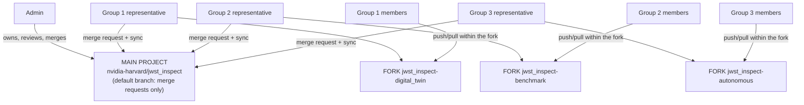

# GitLab workflow: one main project, one fork per team

This is the complete guide to how JWST-Inspect uses GitLab: what lives where,
who can do what, and the exact steps for members, representatives, and the
admin. The short version is in [CONTRIBUTING.md](../CONTRIBUTING.md).

## 1. The layout

One private main project holds everything shared; each team works in its own
fork of it:

- Main project: `https://gitlab.com/nvidia-harvard/jwst_inspect`
- Team forks: `nvidia-harvard/jwst_inspect-digital_twin`,
  `nvidia-harvard/jwst_inspect-benchmark`, `nvidia-harvard/jwst_inspect-autonomous`

Every fork is a full copy of the main project, so every team sees the whole
picture: the docs, the shared data mirror, and all three team trees.

```
jwst_inspect/                  the main project (and every fork of it)
  README.md                    the whole practical guide to the workstation
  stretch_goal.md              the ambitious version of the project
  CONTRIBUTING.md              the one-page version of this workflow
  docs/gitlab_workflow.md      this document
  data/                        shared dataset mirror + manifest + fetch script (section 6)
  assets/                      README images, icons, desktop launchers
  bin/                         student helper commands (jwst-gui, jwst-gpucheck, ...)
  digital_twin/                Group 1 tree: src/ interface/ sbatch/ usd_files/
  benchmark/                   Group 2 tree: src/ interface/ sbatch/
  autonomous/                  Group 3 tree: src/ interface/ sbatch/
```



## 2. Roles and access

The GitLab free tier caps this private namespace at 5 accounts, so seats are
exactly: the admin plus one representative per team. Everyone else has full git
access without a GitLab account, through a per-person SSH deploy key.

- Admin (Arthur Perotti, `arthurpmc5`). Owner of the namespace. Reviews and
  merges merge requests into the main project, manages seats, branch
  protection, deploy keys, the data mirror, and the storage budget.
- Representative (one per team, holds a GitLab seat). Developer on the main
  project (can open and merge merge requests; cannot push its default branch),
  Maintainer on the own team's fork (moves the fork's `main`, reviews member
  branches, syncs from the main project). The representative is the only
  team-side person with the GitLab web UI.
- Member (everyone else). A dedicated SSH key in `~/.ssh/id_ed25519_gitlab`
  on the workstation is registered as a write deploy key on the own team's
  fork - push and pull over git work exactly as with an account. Members do
  not see the GitLab web UI; review requests go to the representative.

Access boundaries: members push only to their own team's fork, and only to
topic branches. The fork's `main` moves only by the representative or the
admin. The main project's `main` moves only by merge request.

## 3. Where git lives on the workstation

- `~/team/jwst_inspect` - the team's shared clone of its fork, always on the
  fork's `main`, kept clean, maintained by the representative. Slurm jobs and
  anything that needs a stable path run from here.
- `~/jwst_inspect` (recommended) - your personal clone of the team fork, where
  you actually develop and from which you push topic branches.
- Clones on the box skip LFS content on checkout (`data/` holds small pointer
  files instead of the gigabytes); the real files are already at
  `/data/shared/raw`. Section 6 explains this.

## 4. Member workflow

One-time setup (the admin pre-provisions the key and its SSH config; the
commands only verify):

```bash
ls ~/.ssh/id_ed25519_gitlab.pub                 # your deploy key (ask the admin if missing)
git config --global user.name                   # your full name (set it if empty)
git config --global user.email                  # your Harvard email (set it if empty)
GIT_LFS_SKIP_SMUDGE=1 git clone git@gitlab.com:nvidia-harvard/jwst_inspect-<team>.git ~/jwst_inspect
cd ~/jwst_inspect && git lfs install --local --skip-smudge
git ls-remote origin > /dev/null && echo "fork access ok"
```

Daily flow:

```bash
cd ~/jwst_inspect
git switch main && git pull --ff-only origin main    # start from the fork's current main
git switch -c <username>/<short-topic>               # e.g. jdoe/replicator-noise-model
# ... build, run, test ...
git add <files> && git commit -m "What changed and why, one line"
git push -u origin <username>/<short-topic>
```

Then tell your representative the branch name (chat or standup); the
representative reviews and merges it into the fork's `main`. After it merges,
`git switch main && git pull --ff-only` and delete your local branch.

What members commit: code under `<team>/src/`, job scripts under
`<team>/sbatch/`, stable contract files under `<team>/interface/`, docs.
What members never commit: anything in section 7's never list, changes to
other teams' trees, or changes to the shared root (`README.md`, `data/`,
`docs/`, `assets/`, `bin/`) - those go through the representative or admin.

## 5. Representative workflow

Review and merge a member branch (in the shared clone or your own):

```bash
cd ~/team/jwst_inspect
git fetch origin
git log --oneline main..origin/<branch>              # what is on it
git diff main...origin/<branch>                      # full review
git switch main && git merge --no-ff origin/<branch> # merge after review
git push origin main                                 # only reps/admin can do this
git push origin --delete <branch>                    # clean up
```

Ship the team's work to the main project (the merge request):

1. On gitlab.com open your fork, create a merge request with source
   `jwst_inspect-<team>:main` and target `jwst_inspect:main`.
2. Title: one line of what lands. Description: what changed, how it was
   validated (command + result), and any interface files other teams consume.
3. The admin (or another team's representative) reviews and merges. Do not
   merge your own merge request unreviewed.

After any merge into the main project (yours or another team's), sync the fork
and the shared clone:

```bash
cd ~/team/jwst_inspect
git fetch upstream                                   # upstream = the main project
git switch main && git merge upstream/main           # bring in the merged state
git push origin main                                 # fork main now matches
```

Cadence: merge member branches within a day or two of the review ask; open a
merge request upstream at least weekly and always when an `interface/` file
changes; sync the fork from upstream after every upstream merge, so members
always branch from a current `main`.

### The GitLab CLI (glab)

`glab` (1.36.0) is installed workstation-wide, so the whole merge-request flow
works from the terminal without the web UI. Representatives are its users;
members do not need it (the section 4 flow is plain git over the deploy key,
and glab requires a GitLab account).

One-time login with your own gitlab.com personal access token (scopes `api` +
`write_repository`; the token is stored under your private home):

```bash
glab auth login --hostname gitlab.com     # pick token auth, paste when prompted
glab auth status                          # verify: Logged in to gitlab.com as <you>
```

Open the merge request from your fork to the main project (replace `<team>`):

```bash
cd ~/team/jwst_inspect
glab mr create -R nvidia-harvard/jwst_inspect -H nvidia-harvard/jwst_inspect-<team> \
  -s main -b main -t "One line of what lands" \
  -d "What changed, how it was validated, which interface files moved"
glab mr list -R nvidia-harvard/jwst_inspect      # open merge requests
glab mr view <id> -R nvidia-harvard/jwst_inspect # details + discussion
```

Merging stays a review action for the admin or another team's representative:
`glab mr merge <id> -R nvidia-harvard/jwst_inspect --remove-source-branch`.

## 6. Data, LFS, and the size budget

- Binary files (FITS, EXR, USD, textures, images, checkpoints) are tracked
  with Git LFS; the patterns live in `.gitattributes`. Committing a new binary
  file type means asking the admin to extend `.gitattributes` first.
- Clones on the box skip LFS downloads (`GIT_LFS_SKIP_SMUDGE=1` at clone,
  `git lfs install --local --skip-smudge` after): `data/` then contains small
  pointer files, and you read the real bytes from `/data/shared/raw`. To
  materialize one file off the box: `git lfs pull -I data/<path>`.
- The GitLab free tier hard-caps every project at 10 GiB (repository plus LFS
  combined); past it the project goes read-only. The admin enforces a working
  budget below that (8 GiB knob) and the seeding tooling refuses to push past
  it. Anything above 100 MB or any new dataset goes through the admin, never
  straight into a commit.
- Everything under `data/` is read-only for teams: it mirrors
  `/data/shared/raw` and changes only through the admin together with
  `data/manifest.csv`. See [data/README.md](../data/README.md).

## 7. What never enters git

- Secrets: `.env`, tokens, SSH keys, passwords. No exceptions.
- Runtime output: `runs/`, Slurm logs (`slurm-*.out`), caches (`isaac-cache/`,
  `ov-cache/`), container filesystems (`*.sqsh`, `oci-*/`), `wandb/`, `mlruns/`.
- Big artifacts with a published home on the box: policy checkpoints go to
  `/data/shared/checkpoints`, generated datasets to `/data/shared/datasets`,
  scene assets to `/data/shared/assets` - each with its manifest/sidecar. Git
  carries the code that produced them plus the small contract files in
  `interface/`, not the artifacts themselves.
- The `.gitignore` at the repo root already covers the known offenders; if git
  offers you thousands of new files, stop and check before adding.

## 8. Conflicts and recovery

- Branch conflicts with the fork's `main`: rebase your branch
  (`git fetch origin && git rebase origin/main`), fix, force-push your own
  topic branch only (`git push --force-with-lease`). Never force-push `main`.
- Two members editing the same file: coordinate through the representative;
  smaller and more frequent branches beat one giant branch.
- Merge-request conflicts between a fork and the main project: the
  representative resolves them in the fork (merge `upstream/main` into the
  fork's `main`, fix, push) and the merge request updates itself.
- Something pushed that should not be (secret, oversized file): tell the admin
  immediately; history on the affected branch gets rewritten centrally.

## 9. Who does what, when

- Member: sync fork `main` before branching (daily); push topic branches and
  ask for review when a unit of work is done; never let a branch drift more
  than a few days from `main`.
- Representative: review and merge member branches (within 1-2 days); merge
  request to the main project weekly and on every interface change; sync fork
  from upstream after every upstream merge; keep `~/team/jwst_inspect` clean
  and current.
- Admin: review and merge main-project merge requests; manage seats, deploy
  keys, protections; update `data/` and `manifest.csv`; audit project size
  monthly against the budget.
